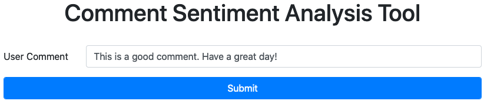
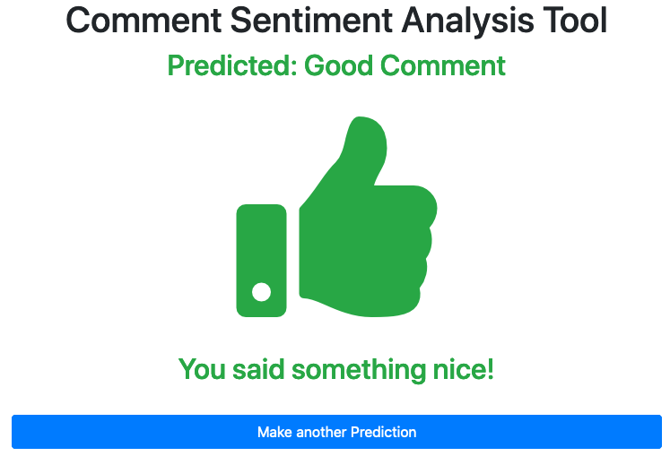

# Social Media Comment Sentiment Analysis REST API

- Nathaniel Haddad haddad.na@northeastern.edu
- Northeastern University
- Disclosure: this is a academic project

---

## Install
packages:
- `pip install pickle-mixin`
- `pip install -U scikit-learn`
- `pip install Flask`

run:
- train a model: (from the root folder) `python comment_clf_model.py`
- run the server: (from the root folder) `python comment_clf_app.py`
- go to the server home: `http://127.0.0.1:5000/v1/api`

    

## Overview
This project represents a series of machine learning models used to identify attacks on users on Wikipedia using natural language processing. Using Scikit-learn and other packages, I built several classifiers that were able to predict whether a comment was an attack or not with a high rate of accuracy.

 | 

## Notes
- Some of the resources I used:
  - https://www.kdnuggets.com/2019/01/build-api-machine-learning-model-using-flask.html
  - https://arxiv.org/abs/1912.02292

